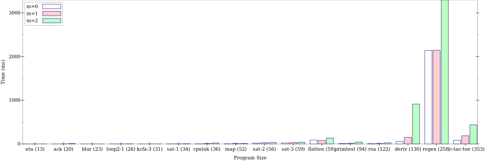
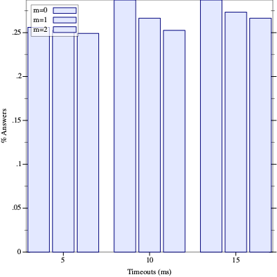
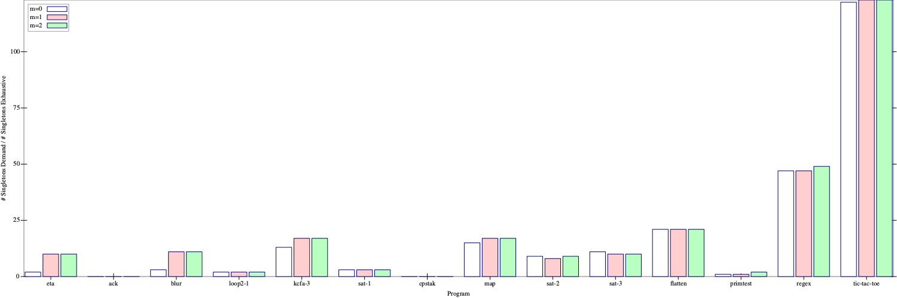
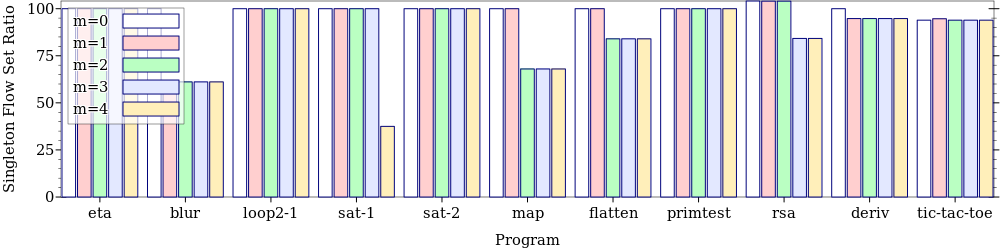

# Artifact for Demand m-CFA
TODO: We should do a graph of all queries with x axis being time, 
y being percent resolved by that time, and another dimension of singletons

- Supports a subset of R6RS
- Supports a subset of Plait (#lang racket/plait)

Context sensitivity is in the m-CFA style (last `m` stack frames).
Implementation uses an ADI style recursive decent big-step interpreter.

## Definitions
Demand-scalable - a constant cost (time / codeunit) gives nontrivial flow information, regardless of program size

## Building / Reproducing

### Compiling the paper and graphs

Make sure texlive is installed `sudo apt install texlive-full` and `racket` (https://download.racket-lang.org/)
```bash
make
```

## Results

Research Question:
Does adding m-CFA style context sensitivity to Demand-CFA give more precise results while remaining demand-scalable?

TLDR: Yes.


### Scalability
1. m-CFA scalability - program size vs time for m=0,1,2



2. Demand m-CFA scalability - timeout vs % nontrivial queries answered (information gained beyond compiler heuristics), series based on a few preset time per code unit values. Graphs for m=0,1,2,..?



3. Scalability in terms of implementation effort:
- MCFA 70 lines (primitives) + 360 (here) = 430
- Demand m-CFA 630 (⊑-cc = 20 loc cc-determined? = 10) = 660
- Shared everything else (in files: abstract value / config / static-contexts / syntax / env / utils / primitives etc)
- All unmentioned files are unrelated to the analysis and are related to debugging / test setup / parsing / analyzing andplotting results
- Regular m-CFA would not work on larger programs with unimplemented primitives, but Demand m-CFA would, so we get useful results already

### Precision
4. Script `main-precision.rkt` checks that precision of Demand-mCFA results are equal to exhaustive exponential m-CFA (for some subset of queries)

5. Reports # results that are singletons across all program points and a comparision to exponential m-CFA.



